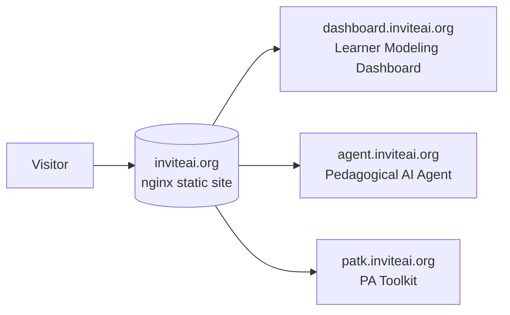

# INVITE Research Software Website

The public landing page at <https://inviteai.org> for the research software built and run
by the **INVITE Institute** (the NSF-IES National AI Institute for Innovative Intelligent
Technologies for Education). It is a single, hand-written static page that indexes each
tool - the Learner Modeling Dashboard, the Pedagogical AI Agent, and the PA Toolkit - with
a short description and a live or coming-soon badge, and links out to where each one runs.



## Quick Start

There is no build step and nothing to install. The site is plain static files, the markup
in `public/index.html` and the styles in `public/styles.css`, with fonts and images pulled
from CDNs. To preview it, serve the folder so the stylesheet and relative paths behave
exactly as they do in production.

```bash
python3 -m http.server 8080 --directory public   # then open http://localhost:8080
```

Edit `public/index.html` or `public/styles.css`, refresh, and you see the change.

## What You Get

- A branded header and page title that match the wider [INVITE Institute](https://invite.illinois.edu/)
  site, so this page reads as part of it.
- A **tool list** where each card carries a name, a one-line description, and a status
  badge. **Live** tools link straight to their subdomain, **Coming Soon** ones are shown
  but not yet linked.
- The **Pedagogical AI Agent** card with its Chat and Character sub-tools grouped
  underneath it.
- A funding-and-disclaimer block (NSF-IES Grant #2229612) and a footer with the
  Institute's social links.

## Layout

| Path | What |
|---|---|
| `public/` | the web root nginx serves, where everything public-facing lives |
| `public/index.html` | the page markup |
| `public/styles.css` | the stylesheet |
| `LICENSE` | project license |

Anything outside `public/` (this README, `LICENSE`, the `.git` history) sits above the web
root and is never served.

## Serving It Remotely

Production is plain nginx serving the static folder, with no application process. The site
config points its root at `public/` and serves `index.html`.

```nginx
server {
    server_name inviteai.org www.inviteai.org;
    root /var/www/invite-web/public;
    index index.html;

    location / {
        try_files $uri $uri/ =404;
    }
    # TLS via Certbot, HTTP redirects to HTTPS
}
```

Deploying is a `git pull` in `/var/www/invite-web`. Nginx picks up the new files
immediately, so no reload is needed for content changes, and you only reload nginx if you
touch the site config itself. The origin sits behind Cloudflare, so a hard refresh or a
cache purge may be needed to see a change right away.

## Under the Hood

Deliberately minimal, static HTML and CSS, no framework, no bundler, no runtime. The
markup lives in `index.html` and the styles in `styles.css`, and keeping them as plain
files makes it trivial to read, edit, review in a diff, and deploy. The tools it links to each live in their own
repository, [lm-dashboard](https://github.com/InviteInstitute/lm-dashboard),
[vex-agent-integration](https://github.com/InviteInstitute/vex-agent-integration), and the
PA Toolkit. This repo is only the front door.
